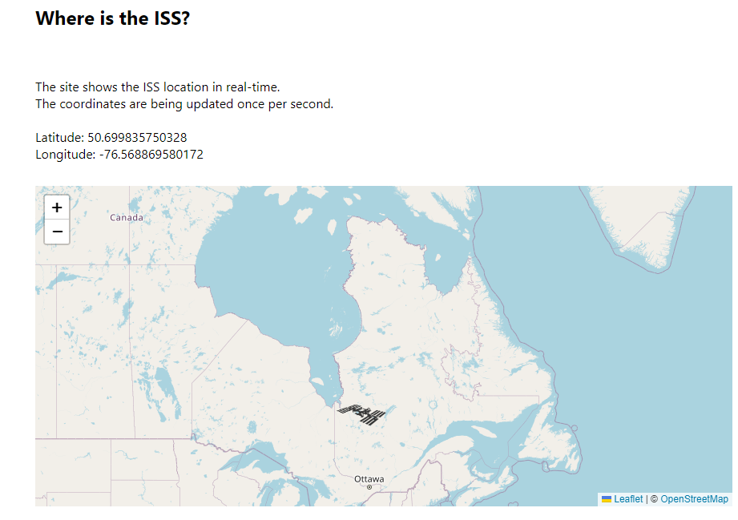

# Mapping Geolocation with Leaflet.js
 
 

## Table of contents

- [Overview](#overview)
  - [About this project](#about-this-project)
  - [Screenshots](#screenshots)
  - [Useful resources](#useful-resources)
- [My process](#my-process)
  - [Workflow](#workflow)
  - [What I learned](#what-i-learned)
  - [Continued development](#continued-development)
- [Acknowledgements](#acknowledgements)
- [Author](#author)

## Overview

### About this project

> This project is about how to work with JSON data fetched from an API.  
> The site loads the current coordinates of the ISS and shows its position in real-time on the map.

### Screenshots



### Useful resources

**"Where the ISS at" API**

- [API Documentation](https://wheretheiss.at/w/developer)
- API endpoint: ``https://api.wheretheiss.at/v1/satellites/25544``  

**Leaflet.js**

- [Leaflet API Reference](https://leafletjs.com/reference.html)
- [Leaflet Quick Start Guide](https://leafletjs.com/examples/quick-start/)

## My process

### Leaflet Workflow

#### I. Preparing the page

1. Include Leaflet CSS file in the head section of your document:

```html
<link
  rel="stylesheet"
  href="https://unpkg.com/leaflet@1.9.3/dist/leaflet.css"
  integrity="sha256-kLaT2GOSpHechhsozzB+flnD+zUyjE2LlfWPgU04xyI="
  crossorigin=""
/>
```

2. Include Leaflet JavaScript file **after** Leaflet’s CSS:

```html
<!-- Make sure you put this AFTER Leaflet's CSS -->
<script
  src="https://unpkg.com/leaflet@1.9.3/dist/leaflet.js"
  integrity="sha256-WBkoXOwTeyKclOHuWtc+i2uENFpDZ9YPdf5Hf+D7ewM="
  crossorigin=""
></script>
```

3. Put a div element with a certain id where you want your map to be:

```html
<div id="map"></div>
```

4. Make sure the map container has a defined height, for example by setting it in CSS:

```css
#map {
  height: 180px;
}
```

#### II. Setting up the map

1. First we’ll initialize the map and set its view to our chosen geographical coordinates and a zoom level:

```javascript
const map = L.map('map').setView([51.505, -0.09], 13);
```

2. Next, we’ll add a tile layer to our map:

```javascript
L.tileLayer('https://tile.openstreetmap.org/{z}/{x}/{y}.png', {
  maxZoom: 19,
  attribution: '&copy; <a href="http://www.openstreetmap.org/copyright">OpenStreetMap</a>',
}).addTo(map);
```

Make sure all the code is called after the div and leaflet.js inclusion. **That’s it!** You have a working Leaflet map now.

#### III. Marker options

1. Create custom ISS icon for marker:

```javascript
const issIcon = L.icon({
  iconUrl: './img/iss.png',
  iconSize: [66, 30],
});
```

2. Create marker and add it to map:

```javascript
const marker = L.marker([0, 0], { icon: issIcon }).addTo(map);
```

3. Set marker position:

```javascript
marker.setLatLng([latitude, longitude]);
```

---

### What I learned

- fetch()
- async functions
- load JSON from API
- Leaflet.js

### Continued development

- set icon size by zoom level
- button "center map to ISS position"
- tracking the ISS route: set marker each 60 seconds

## Acknowledgements

This project is based on this great YouTube tutorial: [Working with Data and APIs in JavaScript](https://www.youtube.com/playlist?list=PLRqwX-V7Uu6YxDKpFzf_2D84p0cyk4T7X).  
Thank you [Coding Train](https://www.youtube.com/@TheCodingTrain). :heart:

## Author

Created by [@Thomas Ulrich](https://github.com/TomUlrich) - feel free to contact me.
